# 🛡️ Awesome E-Commerce Fraud Prevention

  

  
  
  
  

---

**Curated List of SaaS Platforms & Open-Source Projects for Payment Fraud, Chargeback Prevention, Account Takeover (ATO) & Merchant Risk Detection.**

📅 **Last updated: October 2026**

Welcome to the ultimate curated resource for **E-Commerce Fraud Prevention** tools, frameworks, and commercial platforms! Whether you are an online merchant looking for payment chargeback guarantees, a risk manager combating account takeover (ATO), or a software engineer building custom machine learning fraud detection pipelines, this repository provides verified data on top solutions.

---

## 📖 Table of Contents

- [☁️ SaaS & Hosted Fraud Platforms](#️-saas--hosted-fraud-platforms)
- [🔓 Open-Source GitHub Projects](#-open-source-github-projects)
- [🤝 How to Contribute](#-how-to-contribute)
- [💖 Support & Sponsorship](#-support--sponsorship)
- [📈 Star History](#-star-history)
- [⚠️ Disclaimer](#️-disclaimer)

---

## ☁️ SaaS & Hosted Fraud Platforms

> 📊 **Market Size & Industry Dynamics**: The global e-commerce fraud prevention market is estimated at **~$5.5B in 2026** and projected to reach **~$15B by 2032** (CAGR ~18.2%). The market structure is **moderately fragmented** — chargeback guarantee leaders like **Signifyd** and **Riskified** dominate enterprise e-commerce with 1–3% liability shift pricing, while risk-scoring specialists like **Sift**, **Forter**, and **SEON** serve mid-market to enterprise merchants with custom API integrations. Big Tech entrants (such as **Microsoft Dynamics 365 Fraud Protection**) and financial conglomerates (**Equifax/Kount**) maintain strong enterprise market share.

Below is the list of top SaaS fraud prevention platforms, sorted by **Company Revenue / Market Valuation** (descending order):

| Platform | Description | Pricing (Starting Tier) | Free Tier / Trial Limits | Company Size (Valuation / Revenue) |
| :--- | :--- | :--- | :--- | :--- |
| **[Microsoft Dynamics 365 Fraud Protection](https://learn.microsoft.com/en-us/dynamics365/fraud-protection/)** | 🤖 **AI-driven transaction & ATO protection.** Enterprise risk engine with Purchase Protection, Account Protection, and Loss Prevention modules. | **$12/month fixed fee** per Entra tenant + **$0.01/transaction** (Account Protection <100K checks) / **$0.10/transaction** (Purchase Protection <10K checks). | **30-day free trial** available via Microsoft Partner network. | 🏢 **~$281B Annual Revenue** (Microsoft FY2025) |
| **[Kount](https://www.kount.com/)** | 🛡️ **Complete Identity & Fraud Prevention Suite.** Equifax-owned digital identity verification, chargeback prevention, and regulatory compliance. | **$0.01/transaction check** (starting base tier, custom volume quotes apply). | **No free version**, **no free trial** (enterprise demo required). | 🏢 **~$5.5B Annual Revenue** (Equifax parent co.) |
| **[Bolt Fraud Protection](https://www.bolt.com/)** | ⚡ **One-click checkout with zero-fraud liability.** Integrates automated checkout with built-in fraud decisioning and approval optimization. | **1.5% - 2.5% per approved transaction** (includes checkout & chargeback guarantee). | **No free tier**, 14-day guided sandbox demo on request. | 🦄 **~$14B Valuation** (Private) |
| **[Forter](https://www.forter.com/)** | 🧠 **Real-time automated decisioning engine.** Global identity graph matching transactions across global merchant networks to eliminate manual reviews. | **0.5% - 1.2% of GMV** for approved orders + **$5K - $15K** one-time integration fee. | **No free tier**, custom enterprise proof-of-concept (POC) available. | 🦄 **~$3B Valuation** (Private) |
| **[Signifyd](https://www.signifyd.com/)** | 💳 **100% Financial Chargeback Guarantee.** Automated order decisioning with total liability shift for fraudulent chargebacks. | **$1,500/month** base tier (or **1% - 3% of approved transaction volume**). | **No free tier**, 14-day enterprise trial environment available. | 🦄 **~$1.34B Valuation** (Private) |
| **[Sift](https://sift.com/)** | 🔍 **Digital Trust & Safety Platform.** Machine learning protection for payment fraud, account takeover, spam, and content abuse. | **$0.06/month per user check** (minimum starting contract approx. **$1,000/month**). | **14-day free trial** with up to 10,000 test API events. | 🦄 **~$1B Valuation** (Private) |
| **[Riskified](https://www.riskified.com/)** | 📈 **AI chargeback guarantee platform for enterprise e-commerce.** Fully automated merchant order approval with zero risk on chargebacks. | **0.4% - 2.0% of approved order value** (declined orders are free). | **No free tier**, live trial/shadow deployment available for qualified merchants. | 🏛️ **~$310M Revenue / Public** (NYSE: RSKD) |
| **[SEON](https://seon.io/)** | 🌐 **Social & Email footprint fraud screening.** API-first fraud prevention using 900+ real-time digital signals and OSINT checks. | **$699/month** Starter Tier (includes 2,500 fraud API checks & 10 team seats). | **14-day free trial** (up to 2,000 free API queries). | 🚀 **~$100M+ Funding Raised** (Private) |
| **[Fraud.net](https://fraud.net/)** | ☁️ **App-store style risk management cloud.** Orchestration platform integrating enterprise data feeds, AI rules, and graph network risk scoring. | **$499/month** Standard Tier (up to 5,000 risk scoring transactions/month). | **Free plan available** (up to 500 transaction checks/month free forever). | 🏢 **Private (Mid-Market SaaS)** |
| **[NoFraud](https://www.nofraud.com/)** | 🛒 **Turnkey Shopify & e-commerce chargeback protection.** Instant order screening with human expert review fallback and full chargeback reimbursement. | **$250/month** base (or **0.5% - 1.5% of revenue** with full chargeback guarantee). | **Free plan available**: Free forever up to **100 orders/month**. | 🏢 **Private (Bootstrapped/Profitable)** |

---

## 🔓 Open-Source GitHub Projects

The open-source ecosystem for e-commerce fraud prevention provides transparent algorithms, graph databases, and machine learning pipelines for custom tech stacks.

Below are top open-source projects sorted by **GitHub Star Count** (descending order):

| Repository | Description | GitHub Stars |
| :--- | :--- | :--- |
| **[Fraud Detection Handbook (Dataiku)](https://github.com/dataiku/fraud-detection-handbook)** | 📘 **Comprehensive guide & reproducible code for credit card fraud detection.** Covers machine learning models, imbalanced data, sequential features, and cost-sensitive evaluation metrics in Python. |  |
| **[Tirreno](https://github.com/tirreno/tirreno)** | 🛡️ **Universal open-source analytics & fraud prevention platform.** Built with PHP 8 & PostgreSQL. Detects account takeover (ATO), malicious bots, repeat registration fraud, and checks IP/email reputation for web apps & e-commerce. |  |
| **[Apache Fineract Fraud Prevention](https://github.com/apache/fineract)** | 🏦 **Core banking & financial transaction fraud suite.** Open-source enterprise microfinance platform featuring real-time payment audit trails, suspicious transaction alerts, and API gateway rate limiting. |  |
| **[OpenFraud](https://github.com/openfraud/openfraud)** | ⚖️ **Forensic-first Python fraud detection framework.** Combines LightGBM ML models with Memgraph graph analytics. Features the *Boomerang Protocol* ensuring hard forensic mathematical rules (Benford's Law, velocity checks) override ML probabilistic outputs. |  |

---

## 🤝 How to Contribute

Contributions are warmly welcome! Please follow these simple guidelines:

1. Fork this repository.
2. Edit `README.md` to add or update your tool/project.
3. Ensure all SaaS listings include **transparent starting prices**, **free tier/trial limits**, and **company scale metrics**.
4. Ensure open-source projects feature working GitHub repository links and star badges.
5. Create a Pull Request with a clear description of your additions.

---

## 💖 Support & Sponsorship

If you find this curated list valuable for your business, security audits, or research, please consider supporting the project!

- ⭐ **Star this repository** to help others discover it.
- 🔀 **Fork & Share** with your fellow risk engineers and developers.
- ☕ **Buy me a coffee**: If you'd like to support ongoing maintenance and research, visit the Sponsor Dashboard:
  
  

Thank you for supporting open-source software and fraud prevention transparency!

---

## 📈 Star History

---

## ⚠️ Disclaimer

- This list is community-curated and provided for informational purposes only.
- E-commerce fraud prevention platforms process sensitive PII and financial cardholder data; always ensure PCI DSS, GDPR, and SOC2 compliance when integrating solutions.
- Pricing metrics, valuations, and star counts are regularly updated but subject to vendor change. Always verify pricing with respective SaaS vendors before enterprise procurement.

---

  Maintained with ❤️ for e-commerce merchants, risk analysts, payment engineers, and security researchers worldwide.

